# 🚀 BUGS: Bayesian Univariate-Guided Sparse Regression

A scalable Bayesian framework for high-dimensional regression that integrates **marginal signal guidance** with **global–local shrinkage** to achieve:

- strong control of false discoveries  
- near-perfect signal recovery  
- scalability to ultra-high dimensions (\(p \sim 10^6\))  

---

## 🔍 Motivation

Classical shrinkage priors such as the regularized horseshoe (RHS) treat all variables symmetrically. However, in many high-dimensional settings:

- marginal signals contain useful information  
- ignoring them leads to inflated false discoveries  
- computational cost becomes prohibitive  

**BUGS addresses these challenges by guiding shrinkage using marginal evidence while preserving Bayesian rigor.**

---

## 🧠 Core Idea

BUGS augments the regularized horseshoe prior with a **guidance mechanism** based on marginal scores:

\[
\tilde{z}_j^{*} \quad \longrightarrow \quad \exp(\eta \tilde{z}_j^{*})
\]

which adaptively modulates shrinkage.

---

## ⚙️ Model Structure

### Hierarchical formulation

\[
\beta_j \mid \lambda_j, \tau, c, \eta, \sigma^2
\sim \mathcal{N}(0, \sigma^2 \tilde{\kappa}_j^2)
\]

where

\[
\tilde{\kappa}_j^2 =
\frac{c^2 \tau^2 \lambda_j^2 \exp(\eta \tilde{z}_j^{*})}
{c^2 + \tau^2 \lambda_j^2 \exp(\eta \tilde{z}_j^{*})}
\]

and

- \( \lambda_j \): local scale  
- \( \tau \): global scale  
- \( c^2 \): slab parameter (RHS)  
- \( \eta \): guidance strength  

---

### Intuition

- Large \( \tilde{z}_j^{*} \) → **less shrinkage**  
- Small \( \tilde{z}_j^{*} \) → **strong shrinkage**  
- \( \eta = 0 \) → reduces to standard RHS  

---

## 📌 Model Diagram

  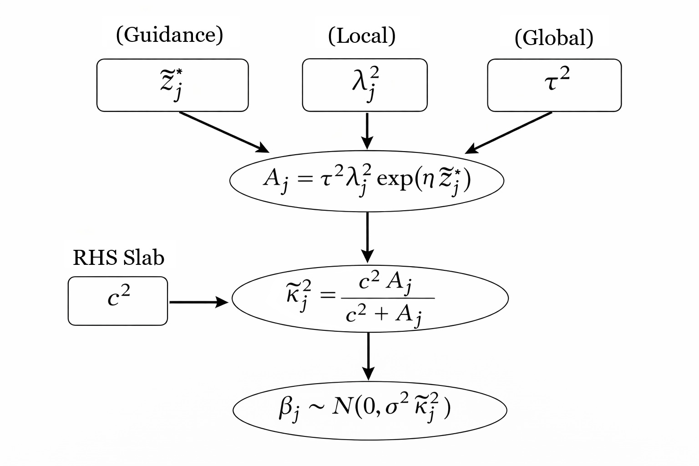

---

## 📈 Effect of Guidance

  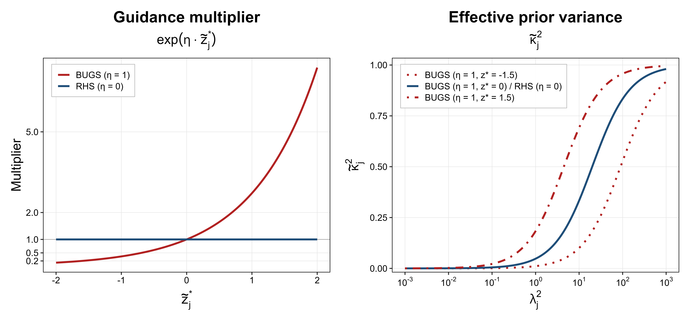

- Guidance selectively inflates variance for promising variables  
- Produces stronger separation between signal and noise  

---

## 📊 Posterior Behavior

  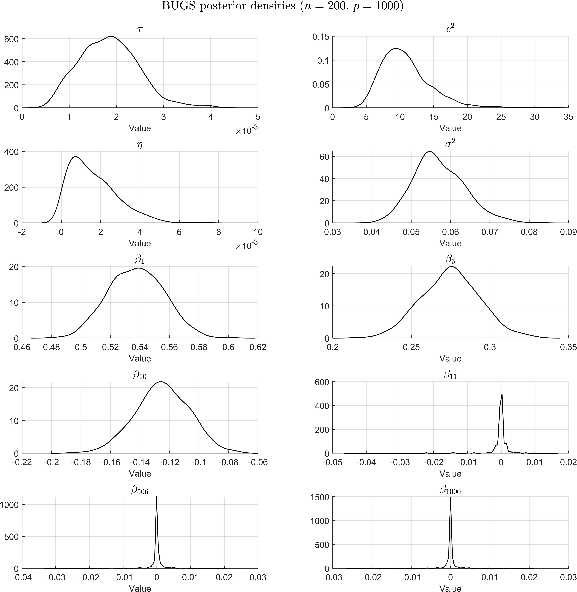

- Signals: well-separated posterior mass  
- Noise: sharply concentrated at zero  

---

## 🔁 MCMC Diagnostics

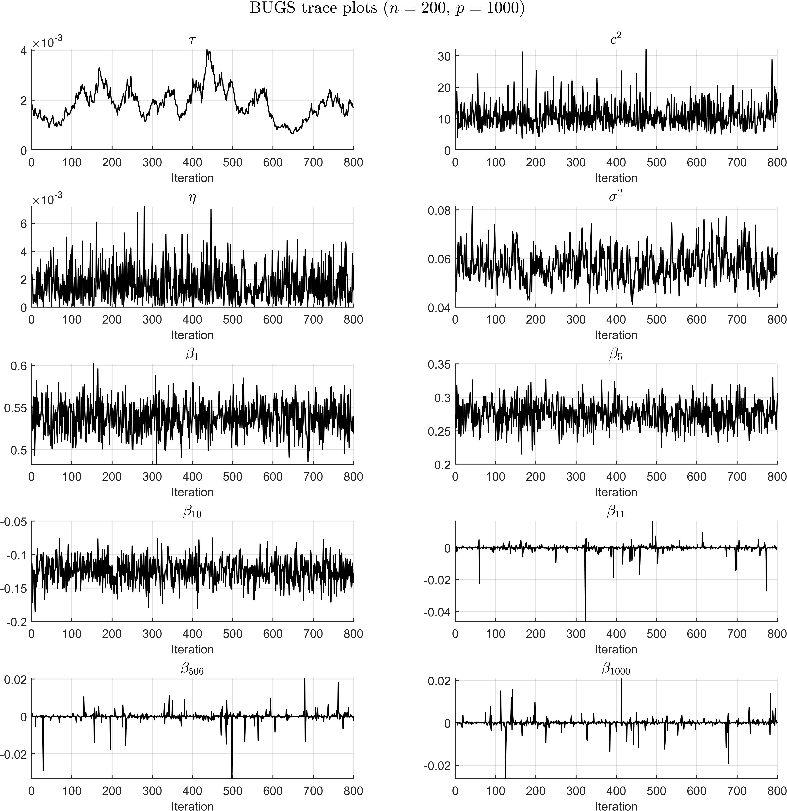

- Stable mixing across parameters  
- No pathological behavior in high dimensions  

---

## 🧪 Signal vs Noise Separation

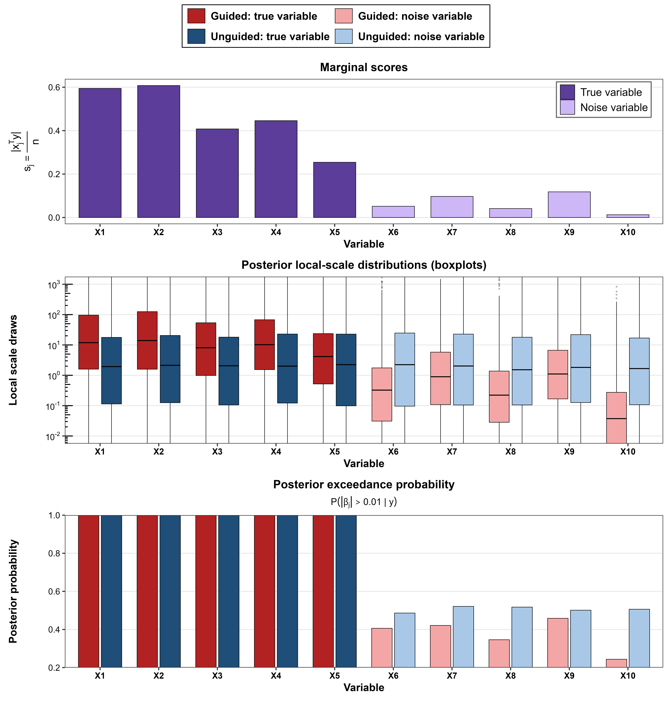

- True variables: high posterior support  
- Noise variables: aggressively shrunk  

---

## ⚡ BUGS-Active: Scalable Inference

To scale to ultra-high dimensions, we introduce **BUGS-Active**:

- restrict updates to a data-adaptive active set  
- reduce complexity from \(O(p)\) to \(O(|A_n|)\)  

---
## Full BUGS vs Active Approximation
### BUGS-Active with different active sizes and full BUGS

  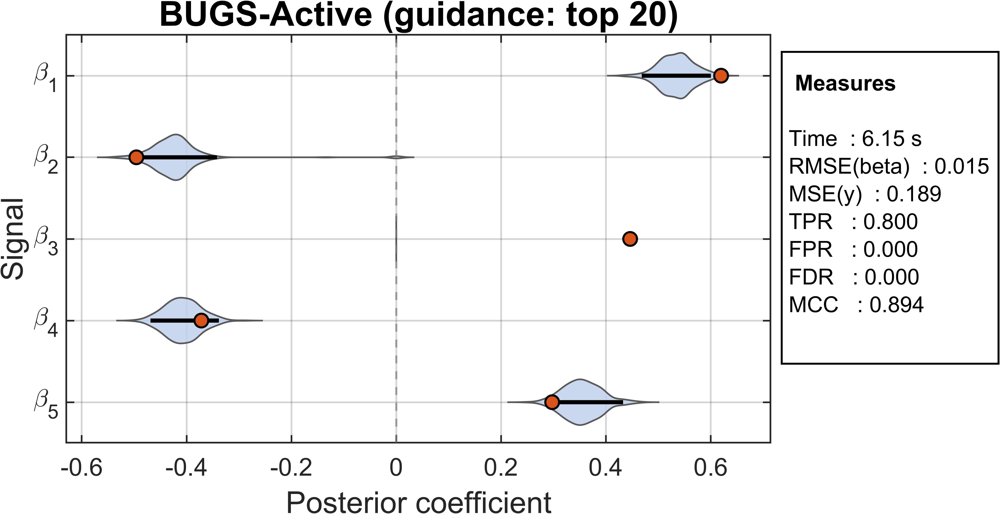
  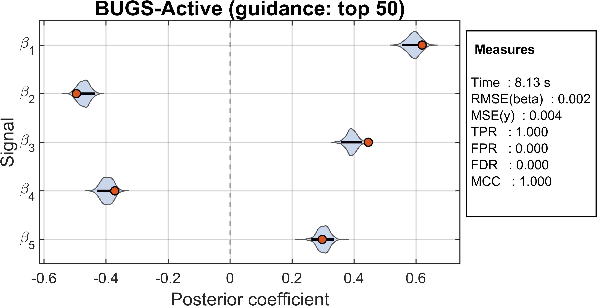

  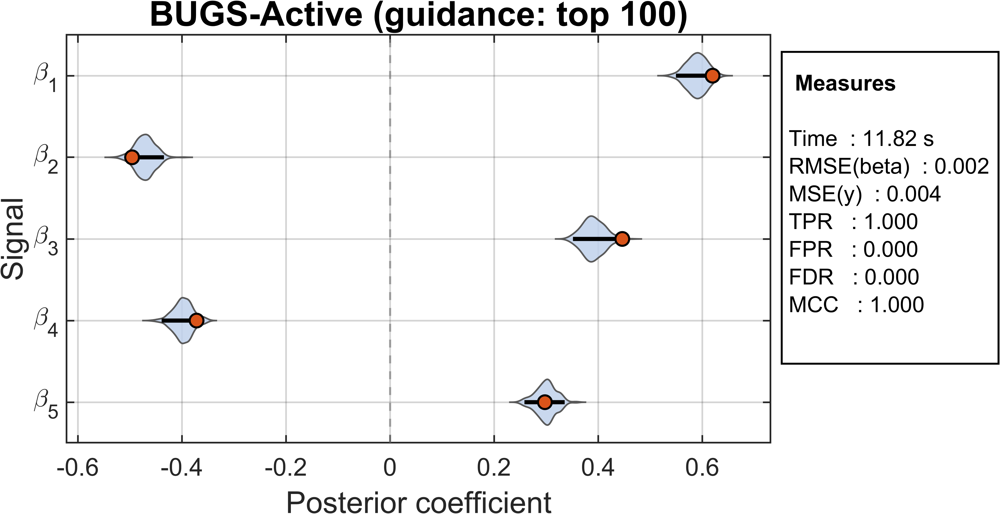
  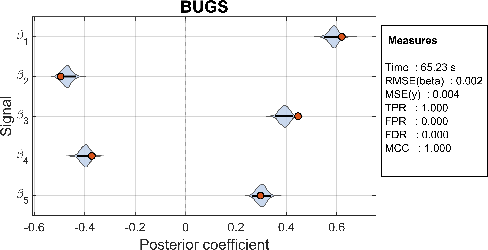

- Maintains high accuracy  
- Dramatically reduces computation time  

---

## 🧬 Real Data Application: DNA Methylation

We apply BUGS-Active to a large-scale DNA methylation dataset  
($n = 1051$, $p \approx 8.6 \times 10^5$ CpG sites), demonstrating:

- Accurate prediction of age from methylation profiles  
- Sparse and interpretable selection of biologically relevant CpGs  
- Stable posterior inference in ultra-high dimensions  

---

### Key Results

  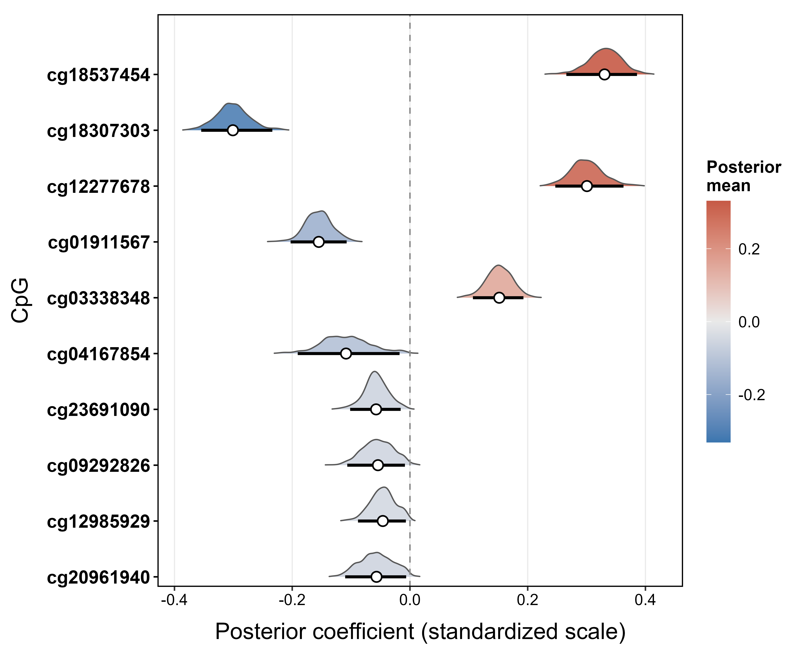
  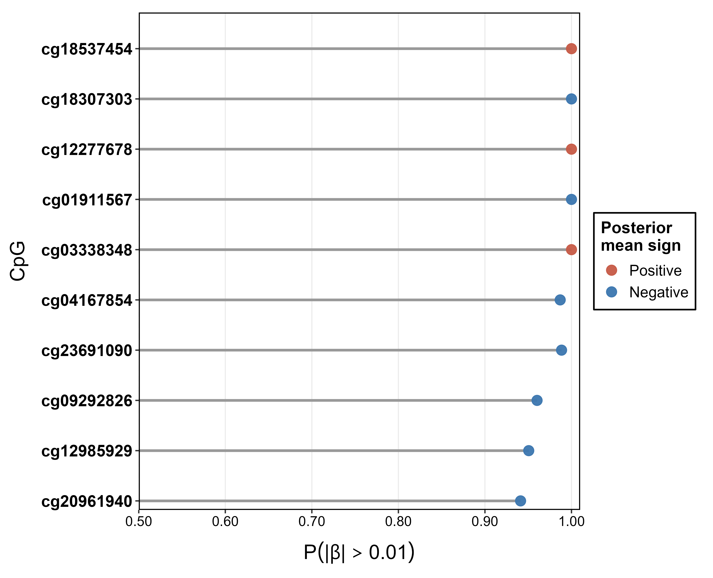

  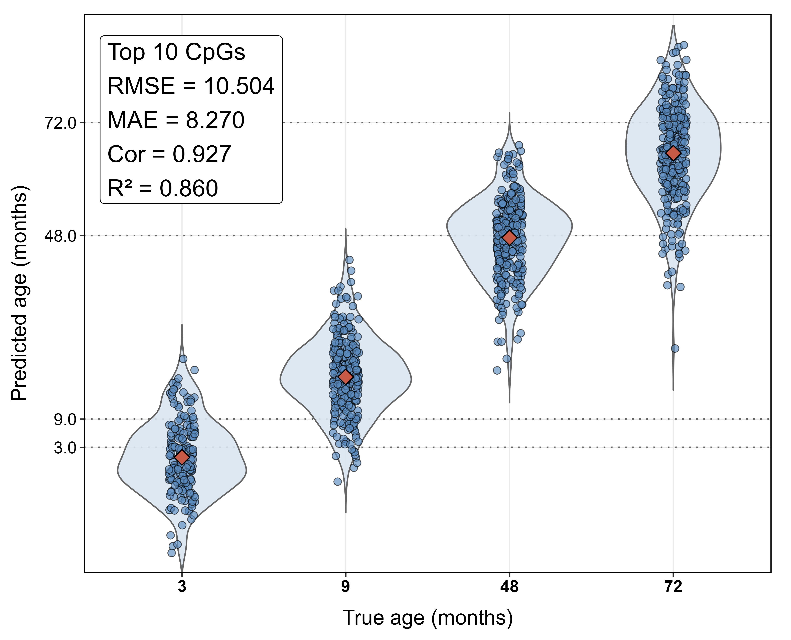
  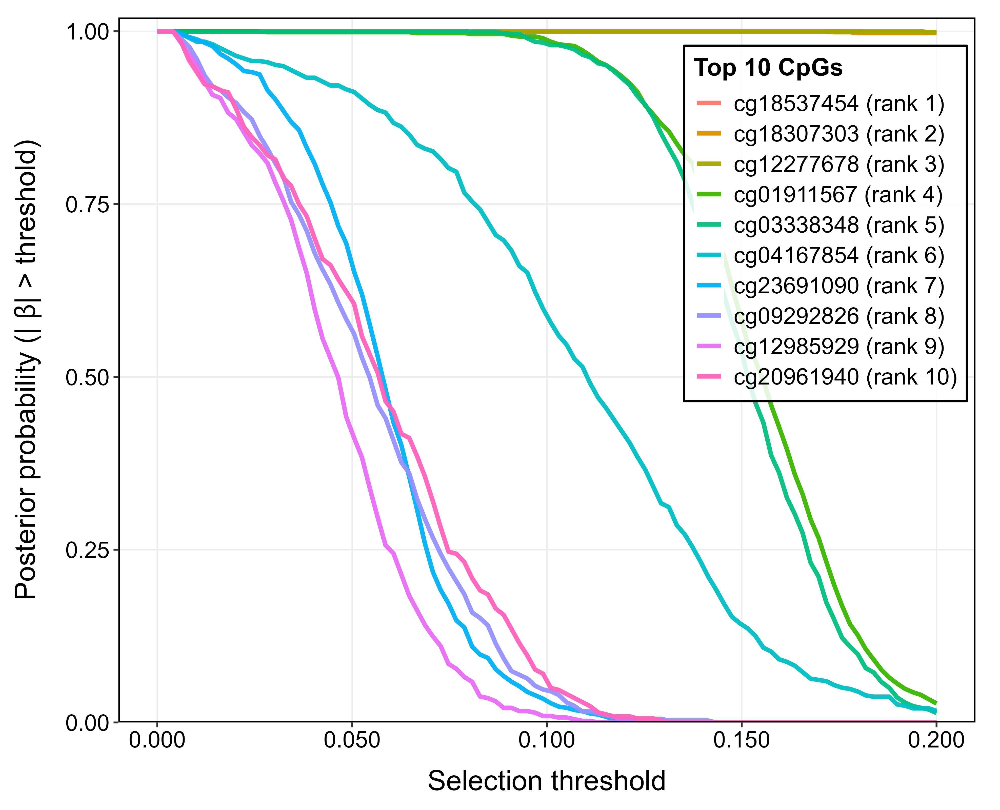

---

### Interpretation

- **Top-left (Posterior effects):**  
  Strong, well-separated coefficient estimates with credible intervals excluding zero  

- **Top-right (Inclusion probabilities):**  
  Near-unit posterior selection probabilities for top CpGs, indicating robust signals  

- **Bottom-left (Predictive performance):**  
  High agreement between predicted and observed age across developmental stages  

- **Bottom-right (Threshold stability):**  
  Clear separation between strong and moderate signals under varying selection thresholds  

---

These results highlight that BUGS-Active achieves **accurate prediction, stable uncertainty quantification, and interpretable variable selection** in ultra-high-dimensional genomic settings.
## 🏆 Key Advantages

### Statistical
- Near-perfect signal recovery  
- Strong FDR control  
- Adaptive shrinkage driven by data  

### Computational
- Scales to \(p \sim 10^6\)  
- Active-set MCMC  
- Efficient posterior updates  

### Practical
- No manual threshold tuning  
- Interpretable posterior summaries  
- Robust to weak signals  

---

## 📌 Summary

BUGS provides a **principled and scalable Bayesian solution** for high-dimensional variable selection by:

- integrating marginal information into shrinkage  
- preserving global–local structure  
- enabling reliable inference at massive scale  

---

## 📄 Reference

(Coming soon — manuscript under review)

---

